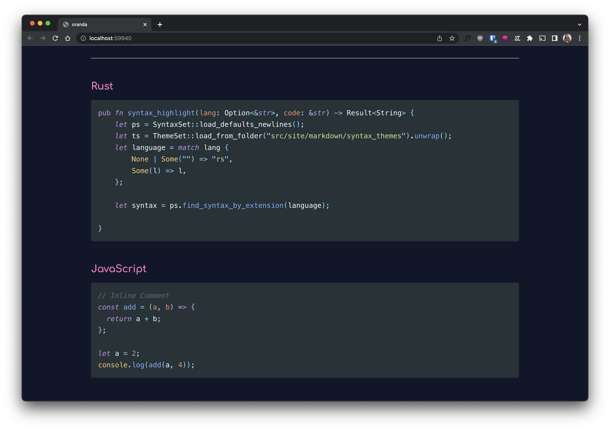
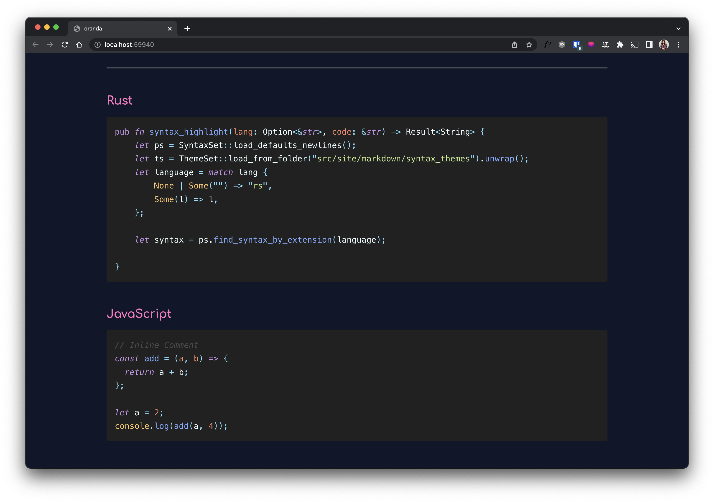
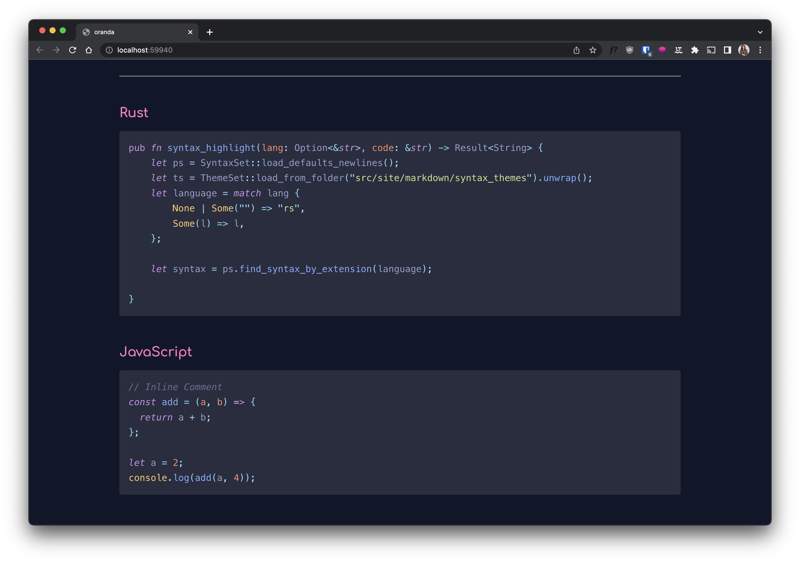
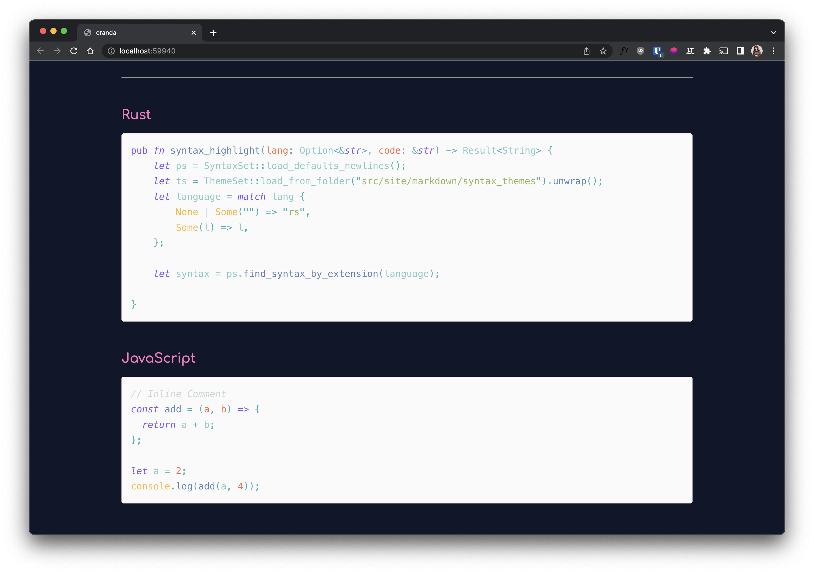

## AgilaClassicOceanicNext

## AgilaCobalt

## AgilaLightSolarized

## AgilaMonokaiExtended

## AgilaNeonMonocyanide

## AgilaOceanicNext

## AgilaOriginOceanicNext

## Base16EightiesDark

## Base16MochaDark

## Base16OceanDark

## Base16OceanLight

## Darkmatter

## Dracula

## GitHubLight

## MaterialTheme

## MaterialThemeDarker

## MaterialThemeLighter

## MaterialThemePalenight

## NightOwl

## OneDark

