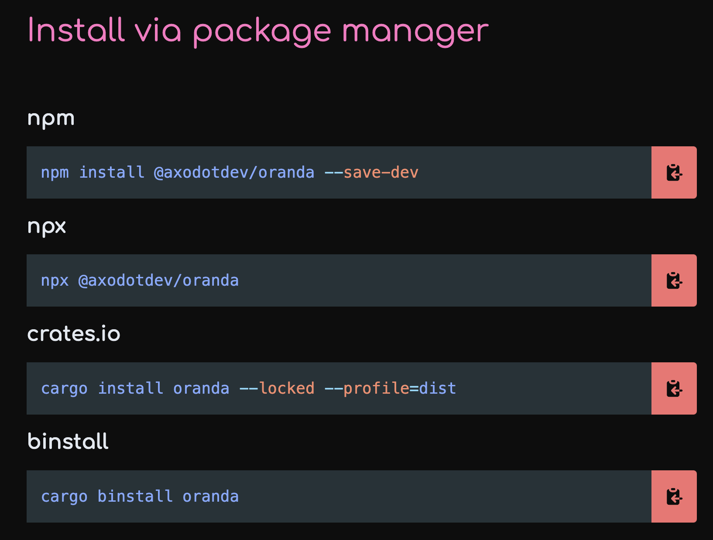

# Artifacts & `cargo-dist`

oranda has first-class support for linking to generated artifacts and installers, using [`cargo-dist`].

Artifact settings are managed in the `artifacts` key in your oranda config. This is what an example config looks like:

```json
{
  "artifacts": {
    "cargo_dist": true,
    "package_managers": {
      "npm": "npm install @axodotdev/oranda --save-dev",
      "npx": "npx @axodotdev/oranda",
      "crates.io": "cargo install oranda --locked --profile=dist",
      "binstall": "cargo binstall oranda"
    }
  }
}
```

## Enabling cargo-dist

Enabling `cargo-dist` support is as simple as settings `artifacts.cargo_dist` to `true`. This will have the following effects:

- oranda will attempt to find GitHub releases generated by `cargo-dist`
- A new "Install" page will be generated, containing all artifacts and installers for the latest version
- A section to quickly install the latest release will be added to the homepage, provided that your `cargo-dist`
  configuration includes any installers

## Adding package manager installation instructions

You can add custom installation instructions for package managers or package manager-esque methods using the
`artifacts.package_managers` key. This is what the above example looks like:



[`cargo-dist`]: https://opensource.axo.dev/cargo-dist/
