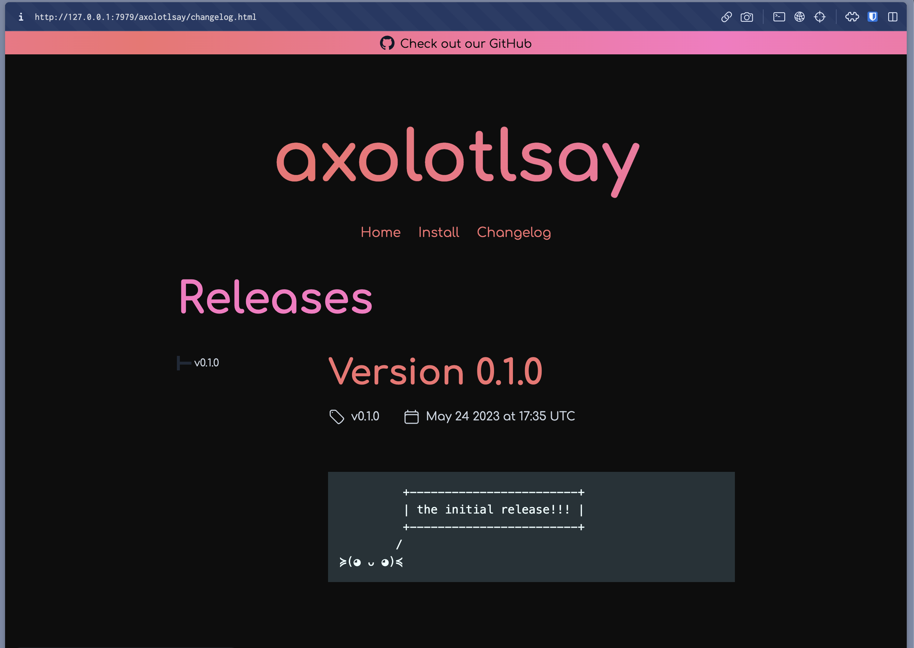

# Quickstart

After you've [installed](./install.md) oranda, it's time to give it a spin. Make sure you can execute the
`oranda` command, its output should look something like this:

```
$ oranda
🎁 generate beautiful landing pages for your projects

Usage: oranda [OPTIONS] <COMMAND>

Commands:
build
dev
serve
help Print this message or the help of the given subcommand(s)

Options:
-h, --help Print help (see more with '--help')
-V, --version Print version

GLOBAL OPTIONS:
--verbose <VERBOSE> How verbose logging should be (log level) [default: warn] [possible values:
off, error, warn, info, debug, trace]
--output-format <OUTPUT_FORMAT> The format of the output [default: human] [possible values: human, json]

```

## Basic Setup

oranda is designed to be a tool you can simply drop into an existing project. For the purposes of this
guide, we're going to use [axolotlsay], a simple CLI project, but you can use one of your own
projects, or even set up a new one from scratch! The only hard requirement oranda has is for your
project to have a readme file (`README.md`).

The easiest way to get a feedback loop going with oranda is to move into the directory and run `oranda dev`:

```
cd axolotlsay
oranda dev
```

[`oranda dev`](./cli/dev.md) is a command that will automatically recompile your oranda build when you change
one of the files relevant to it. It also launches a file server that'll allow you to look at the output -
if you open localhost:7979, you'll see something like this:


oranda has picked up on our readme file and converted it into a static page! How nice!

## Beyond the Basics

If we want to work with the more advanced features that oranda offers, we'll have to create a configuration file.
The default location of this file is `oranda.json` in your project root. You can view a full reference of the
configuration schema [here](./configuration.md), but for now, let's focus on doing something else – we want to
show the releases of our project on this website we've generated.

oranda supports _changelog generation_, meaning we can opt into generating a page that pulls directly from our
GitHub releases.  If you're working with `axolotlsay`, you have have noticed that oranda automatically pulls
some metadata from our project manifest - in this case our `Cargo.toml` file. This means oranda already knows
where our project is on GitHub, so to enable changelogs, we create our configuration file as such:

```json
{
  "changelog": true
}
```

If you now build again, it should look like this:



oranda pulled our project's releases from GitHub automatically, without us having to specify any further configuration
than enabling the changelog setting!

## Further Steps

For more specific configuration, check out the [configuration page](./configuration.md) and its sub-pages.

[axolotlsay]: https://github.com/axodotdev/axolotlsay
