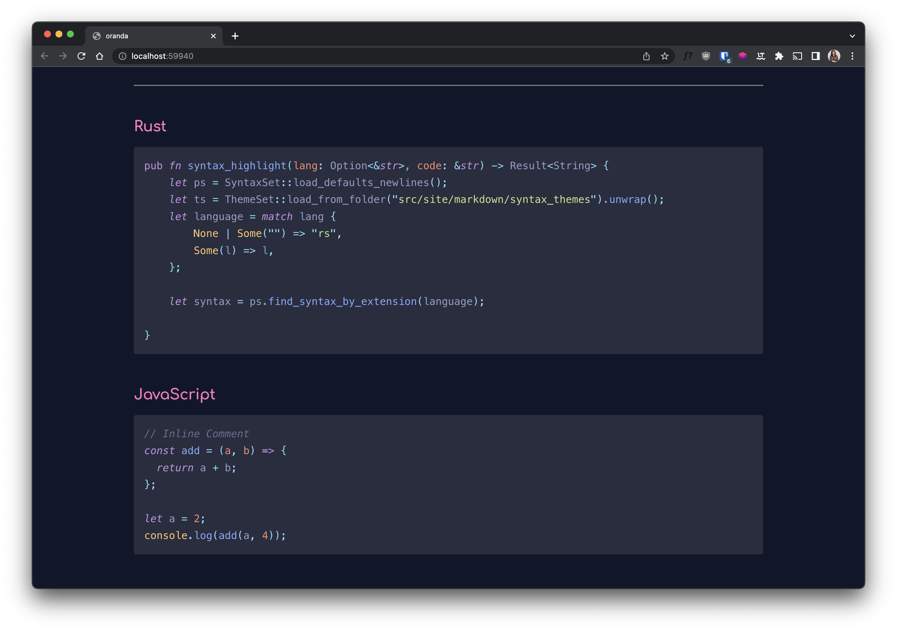

## Agila Classic Oceanic Next

## Agila Cobalt

## Agila Light Solarized

## Agila Monokai Extended

## Agila Neon Monocyanide

## Agila Oceanic Next

## Agila Origin Oceanic Next

## Base16 Eighties Dark

## Base16 Mocha Dark

## Base16 Ocean Dark

## Base16 Ocean Light

## Darkmatter

## Dracula

## GitHub Light

## Material-Theme

## Material-Theme-Darker

## Material-Theme-Lighter

## Material-Theme-Palenight

## Night Owl

## One Dark

